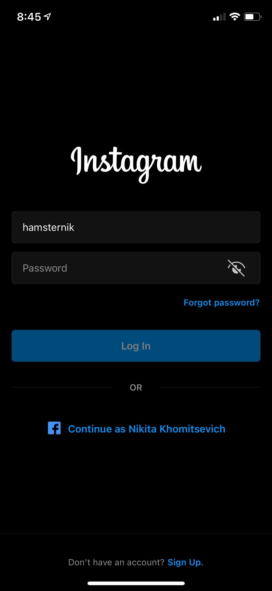

# Домашнее задание #2

### ТЗ, описание что надо сделать

Небходимо создать iOS приложение, состоящее из 1 экрана -- экран логина (login), взятый из реально приложения Instagram.

#### Набор требований к готовому приложению при проверке д/з

- приложение должно собираться и запускаться у меня через Xcode без каких-либо ошибок компиляции (warnings допускаются).
- - Приложение должны запускаться только под iPhone/iPod.
- на главной странице репозитория (или в корневой папке проекта) должно быть описание того, как мне запустить проект (даже если это одна строка текста, где говориться "скачать репозиторий и открыть .xcodeproj файл).
- приложение должно иметь такой дизайн, как изображено на прилагаемом скриншоте. Важно: доскональная точность мне не нужно, если вы не знаете, сколько пикселей отступ между надписью Instgram и полем для ввода username, подберите "на глаз", чтобы визуально было похоже на то, как на скриншоте.
- шрифты и картинки можно найти в интернете (пример: картинки искать на https://icons8.com). Идеальную точность соблюдать не надо, но визуально выбранные ваши иконки/шрифты должны быть похожи на те, что на скриншоте.
- все кнопки, что вы видите на экране ("forgot password", "log in", "Continue as Nikita Khomitsevych", "sign up") должны визуально нажиматься. Никаких реальных действий (по типу открытия нового экрана для регистрации, или входа через facebook под моим аккаунтом) делать **не нужно**! Единственное действие, которое должно выполняться при нажатии на любую из вышеперечисленных кнопок -- вывод текста в консоль Xcode (использовать ф-ию `print`).
- оба текстовых поля ввода (username, password) должны иметь text placeholder (если пользователь ничего не ввёл в какое-либо поле). Текст плейсхолдеров: "Username" и "Password" соответственно.
- кнопка "closed eye" должна выполнять функцию показа/сокрытия введенного пароля в текстовое поле. По-умолчанию (при запуске приложения) кнопка показывает изображение закрытого клаза, после нажатия на кнопку -- картинка меняется на "opened eye", и весь текст пароля должен стать виден на экране
- Когда появляется клавиатура на экране (когда юзер нажал на поле ввода текста), кнопка Return клавиатуры должна скрывать клавиатуру.
- Когда клавиатура видна на экране, если пользователь нажал в любую точку экрана, кроме клавиатуры -- клавиатура также должна скрыться (как при нажатии на кнопку Return).
- приложение должно работать только в Portrait режиме. Переворачивание телефона не должно менять ориентацию интерфейса приложения.
- нижняя часть экрана должна быть статической и всегда видна внизу (iOS разработке называется `footer`). Если вы сделали так, что на каком-либо маленьком девайсе у вас скрывается footer -- нужно сделать так, что бы он всегда показывался, даже если контент на экране не влезает. К примеру, кнопка "Continue as Nikita Khomitsevyc" частично прячется под экраном.

#### WARNING

У вас полная свобода с точки зрения реализации. Любые вещи, которые приведут к нужному резльутату (читай, удовлетворил все требования выше) дадут максимум баллов за задание!
Если ты вдруг сомневаешься, а правильно ли ты сделал, но твоя реализация работает и соблюдает все требования, значит ты все сделал правильно.

Мы в курсе фокусируеммся только на результате, а не на идеальности или оптимальности самого решения! Поэтому, не бойся делать, как думаешь, если это работает.

Когда буду проверять домашку, если найду вещи совсем необычные/нестандартные решения, которые можно сделать лучше/проще -- я об этом напишу. Но баллы снимать не будут!

Удачи!!!

### Как должен выглядеть экран проекта домашнего задания
- 